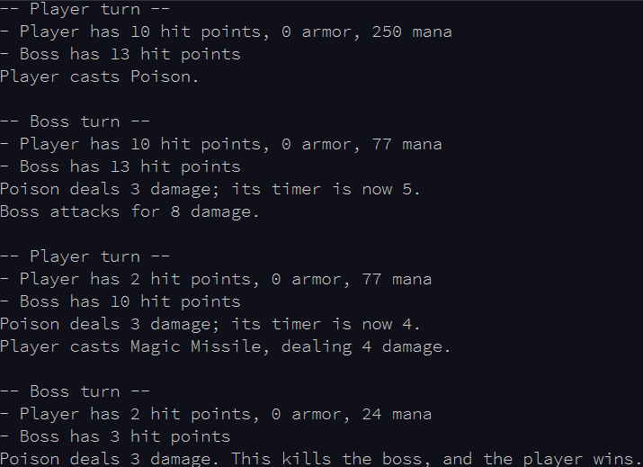
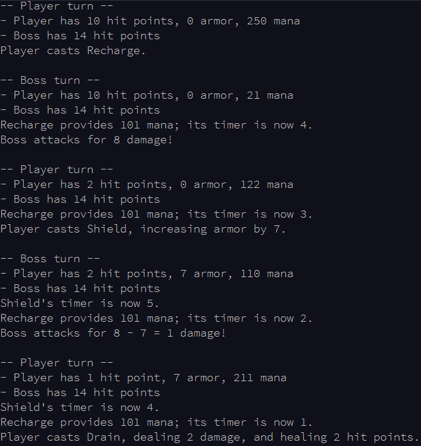
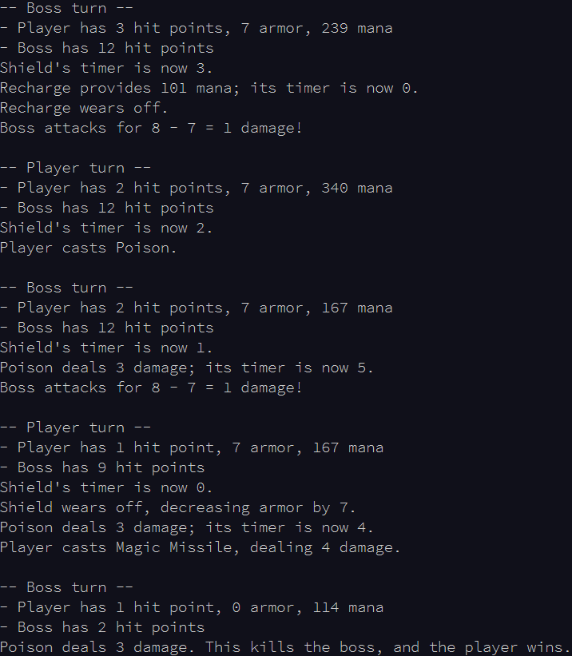

# Part 1

Little Henry Case decides that defeating bosses with swords and stuff is boring. Now he's playing the game with a wizard. Of course, he gets stuck on another boss and needs your help again.

In this version, combat still proceeds with the player and the boss taking alternating turns. The player still goes first. Now, however, you don't get any equipment; instead, you must choose one of your spells to cast. The first character at or below 0 hit points loses.

Since you're a wizard, you don't get to wear armor, and you can't attack normally. However, since you do magic damage, your opponent's armor is ignored, and so the boss effectively has zero armor as well. As before, if armor (from a spell, in this case) would reduce damage below 1, it becomes 1 instead - that is, the boss' attacks always deal at least 1 damage.

On each of your turns, you must select one of your spells to cast. If you cannot afford to cast any spell, you lose. Spells cost mana; you start with 500 mana, but have no maximum limit. You must have enough mana to cast a spell, and its cost is immediately deducted when you cast it. Your spells are Magic Missile, Drain, Shield, Poison, and Recharge.

- Magic Missile costs 53 mana. It instantly does 4 damage.
- Drain costs 73 mana. It instantly does 2 damage and heals you for 2 hit points.
- Shield costs 113 mana. It starts an effect that lasts for 6 turns. While it is active, your armor is increased by 7.
- Poison costs 173 mana. It starts an effect that lasts for 6 turns. At the start of each turn while it is active, it deals the boss 3 damage.
- Recharge costs 229 mana. It starts an effect that lasts for 5 turns. At the start of each turn while it is active, it gives you 101 new mana.

Effects all work the same way. Effects apply at the start of both the player's turns and the boss' turns. Effects are created with a timer (the number of turns they last); at the start of each turn, after they apply any effect they have, their timer is decreased by one. If this decreases the timer to zero, the effect ends. You cannot cast a spell that would start an effect which is already active. However, effects can be started on the same turn they end.

For example, suppose the player has 10 hit points and 250 mana, and that the boss has 13 hit points and 8 damage:

 	

 

Now, suppose the same initial conditions, except that the boss has 14 hit points instead:

 	

 

 	

 

You start with 50 hit points and 500 mana points. The boss's actual stats are in your puzzle input. What is the least amount of mana you can spend and still win the fight? (Do not include mana recharge effects as "spending" negative mana.)

# Part 2

On the next run through the game, you increase the difficulty to hard.

At the start of each player turn (before any other effects apply), you lose 1 hit point. If this brings you to or below 0 hit points, you lose.

With the same starting stats for you and the boss, what is the least amount of mana you can spend and still win the fight?