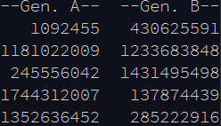
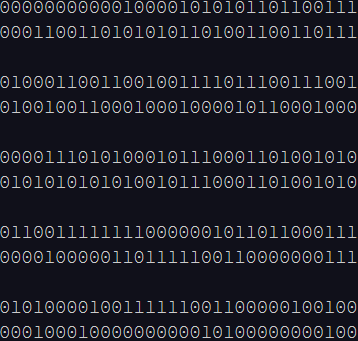
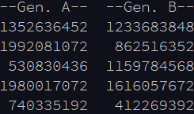
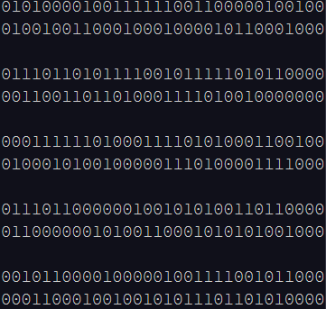
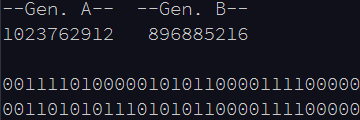

# Part 1

Here, you encounter a pair of dueling generators. The generators, called generator A and generator B, are trying to agree on a sequence of numbers. However, one of them is malfunctioning, and so the sequences don't always match.

As they do this, a judge waits for each of them to generate its next value, compares the lowest 16 bits of both values, and keeps track of the number of times those parts of the values match.

The generators both work on the same principle. To create its next value, a generator will take the previous value it produced, multiply it by a factor (generator A uses 16807; generator B uses 48271), and then keep the remainder of dividing that resulting product by 2147483647. That final remainder is the value it produces next.

To calculate each generator's first value, it instead uses a specific starting value as its "previous value" (as listed in your puzzle input).

For example, suppose that for starting values, generator A uses 65, while generator B uses 8921. Then, the first five pairs of generated values are:

 	

In binary, these pairs are (with generator A's value first in each pair):

 	

Here, you can see that the lowest (here, rightmost) 16 bits of the third value match: 1110001101001010. Because of this one match, after processing these five pairs, the judge would have added only 1 to its total.

To get a significant sample, the judge would like to consider 40 million pairs. (In the example above, the judge would eventually find a total of 588 pairs that match in their lowest 16 bits.)

After 40 million pairs, what is the judge's final count?

# Part 2

In the interest of trying to align a little better, the generators get more picky about the numbers they actually give to the judge.

They still generate values in the same way, but now they only hand a value to the judge when it meets their criteria:

- Generator A looks for values that are multiples of 4.
- Generator B looks for values that are multiples of 8.

Each generator functions completely independently: they both go through values entirely on their own, only occasionally handing an acceptable value to the judge, and otherwise working through the same sequence of values as before until they find one.

The judge still waits for each generator to provide it with a value before comparing them (using the same comparison method as before). It keeps track of the order it receives values; the first values from each generator are compared, then the second values from each generator, then the third values, and so on.

Using the example starting values given above, the generators now produce the following first five values each:

 	

These values have the following corresponding binary values:

 	

Unfortunately, even though this change makes more bits similar on average, none of these values' lowest 16 bits match. Now, it's not until the 1056th pair that the judge finds the first match:

 	

This change makes the generators much slower, and the judge is getting impatient; it is now only willing to consider 5 million pairs. (Using the values from the example above, after five million pairs, the judge would eventually find a total of 309 pairs that match in their lowest 16 bits.)

After 5 million pairs, but using this new generator logic, what is the judge's final count?